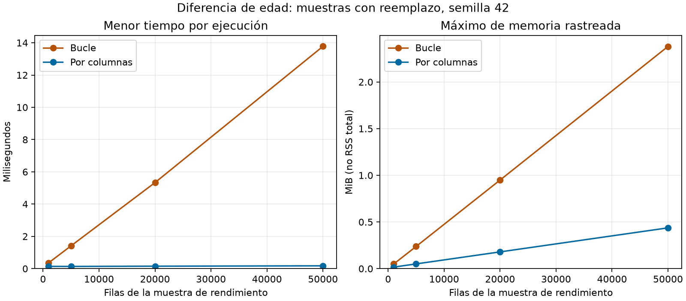

# Tiempo, memoria y complejidad de la diferencia de edad

Comparamos las funciones `diferencia_con_bucle` y `diferencia_por_columnas` de
`F3/src/diferencia_edad.py`. Ambas calculan `p4 - p91` con el mismo contrato:
serie `Int64`, signo, faltantes, nombre e índice conservados. El bucle es una
alternativa didáctica. F2 ya usa la resta por columnas y se mantiene esa decisión.

## Relación con el material docente

Seguimos la sección 10 del notebook docente
`S2_F3_NucleoAlgoritmico_Eficiencia_POO.ipynb`: funciones equivalentes, igualdad
antes de medir, `timeit` y muestras de 1.000, 5.000, 20.000 y 50.000 filas obtenidas
con reemplazo y semilla. La práctica de Semana 2, sección IV, también presenta
tiempo y memoria. Usamos `tracemalloc`, separando su ejecución del cronometraje
para que el rastreo no distorsione los tiempos. No se añade recursividad: las
responsabilidades se dividen en funciones con etapas conocidas.

## Entrada y procedimiento

1. Verificamos y cargamos el CSV original de ENSSEX mediante F2, seleccionamos
   las 8.579 personas convivientes y limpiamos los códigos con el esquema vigente.
2. Exigimos igualdad exacta de las dos alternativas con la derivada de F2 sobre
   esas 8.579 personas. Esta operación no forma parte del intervalo medido.
3. Para cada tamaño, tomamos solo `p4` y `p91`, con `sample(replace=True,
   random_state=42)` y reiniciamos el índice. Usar reemplazo en todos los tamaños
   mantiene el procedimiento de generación. Las tablas son muestras de
   rendimiento, no participantes adicionales ni una ampliación del estudio.
4. Comprobamos igualdad exacta entre las alternativas en cada muestra y contamos
   diferencias ausentes. La verificación también sirve de calentamiento previo.
5. Ejecutamos cinco repeticiones por alternativa y tamaño, con cinco llamadas
   por repetición. Dividimos cada tiempo de bloque por cinco y guardamos los
   cinco tiempos por ejecución. Informamos el menor; no es una media ni un
   intervalo de confianza. Alternamos el orden de las alternativas; los tamaños
   se recorren de menor a mayor.
6. Medimos memoria en una ejecución adicional por alternativa y tamaño y
   comprobamos que la muestra de entrada se conserva. Al terminar verificamos
   también la tabla limpia y la huella exacta del CSV original.

El tiempo incluye la validación común de estructura y tipos, la resta, creación
de la serie y descarte del resultado temporal. Excluye carga, limpieza, muestreo,
comparación, verificación de huellas, impresión, escritura y gráfico. Se realiza
`gc.collect()` antes de cada bloque; `timeit` desactiva el recolector cíclico dentro
del intervalo con su comportamiento predeterminado.

La tabla de entrada tiene dos columnas fijas. El máximo de `tracemalloc` mide
asignaciones rastreadas durante la llamada, incluidos los temporales que alcance
a observar; no incluye toda la memoria ya residente ni equivale al RSS total.
La memoria de la serie devuelta se informa por separado con
`memory_usage(index=True, deep=True)`: cuenta también su índice compartido y no
debe interpretarse como memoria adicional asignada exclusivamente a la función.
Una ejecución de memoria no permite estimar su variabilidad. MiB equivale a
1.048.576 bytes.

## Resultados locales

Evidencia completa: [JSON de medición](medicion_diferencia_edad.json).
Ejecución del 26/09/2026: Windows 11 AMD64, Python 3.13.15, pandas 3.0.5,
numpy 2.5.3. El JSON conserva versiones, huellas de código y esquema normalizadas
a LF, identidad de la fuente, semilla, tamaños, orden y todas las repeticiones.

| Filas | Bucle: menor tiempo (ms) | Columnas: menor tiempo (ms) | Bucle: máximo rastreado (MiB) | Columnas: máximo rastreado (MiB) | Serie devuelta, ambas (MiB) |
|---:|---:|---:|---:|---:|---:|
| 1.000 | 0,3612 | 0,1409 | 0,0497 | 0,0165 | 0,0087 |
| 5.000 | 1,4123 | 0,1368 | 0,2376 | 0,0508 | 0,0430 |
| 20.000 | 5,3334 | 0,1526 | 0,9492 | 0,1795 | 0,1718 |
| 50.000 | 13,7771 | 0,1744 | 2,3810 | 0,4370 | 0,4293 |



El gráfico conecta mediciones observadas; no es un ajuste estadístico ni una
extrapolación. En esta ejecución la operación por columnas tiene menores tiempos
y máximos rastreados en los cuatro tamaños. A 50.000 filas, la razón entre los
menores tiempos es aproximadamente 79. Esa cifra corresponde solo a este cálculo
y entorno; no es una aceleración de 79 veces de todo el pipeline.

## Explicación de complejidad

Sea `n` el número de filas, con dos columnas de enteros de ancho fijo. Excluimos
de este análisis la carga del archivo y la generación de muestras, como en el
cronometraje. La validación de nombres y tipos trabaja sobre dos columnas fijas.

| Alternativa | Trabajo por tamaño | Tiempo | Espacio incluyendo la salida |
|---|---|---|---|
| Bucle | Recorre `n` pares, comprueba ausencias y acumula un resultado por par; luego construye la serie | O(n) | O(n): lista temporal y serie de `n` elementos |
| Por columnas | Opera sobre los arreglos de las dos columnas y sus máscaras de ausencia; construye `n` resultados | O(n) | O(n): serie resultante y posibles arreglos temporales |

La salida explícita de `n` elementos exige trabajo y almacenamiento lineales.
Con las operaciones empleadas, ambas alternativas tienen orden lineal; escribir
la resta en una sola línea no convierte su tiempo en O(1). El cálculo por columnas
reduce el trabajo ejecutado elemento a elemento en Python. Cambian las constantes
y los temporales, no el orden de crecimiento. El detalle de las copias y buffers
puede depender de la versión de pandas; no suponemos espacio auxiliar constante
para la resta por columnas.

La memoria observada aumenta aproximadamente en proporción a `n` en ambas
alternativas. El bucle muestra un aumento temporal claro. En la operación por
columnas, los costos fijos dominan este rango: incluso 5.000 filas dieron un menor
tiempo que 1.000. Esa variación y la curva casi plana no demuestran O(1), ni cuatro
tamaños prueban matemáticamente Big O. La justificación procede de las operaciones
y las mediciones aportan evidencia empírica limitada al rango ensayado.

**Decisión:** conservamos la resta por columnas que F2 ya usa, por claridad y por
los resultados observados, una vez comprobada la equivalencia. El bucle permanece
como contraste didáctico. No cambia la selección, las reglas ni el pipeline.

## Reproducir y revisar

Desde la raíz del repositorio, con el entorno del proyecto y el CSV original:

```bash
python F3/tests/validar_diferencia_edad.py
python F3/tests/validar_medicion_algoritmos.py
python F3/benchmarks/medir_diferencia_edad.py --salida F3/benchmarks/resultados_locales/diferencia_edad.json
```

El ejecutor genera el JSON y un PNG del mismo nombre. Rechaza una ruta cuyo JSON
o PNG ya exista: elegir otro nombre para conservar ejecuciones anteriores. No es
una escritura atómica de ambos archivos; una interrupción puede dejar uno solo.
La carpeta de resultados locales está excluida de Git. La evidencia seleccionada
en `F3/docs` permanece como referencia.

Las pruebas controladas comprueban muestreo reproducible, registro de repeticiones,
orden alternado, faltantes y métricas de memoria. Introducen un resultado distinto
para verificar que se rechaza antes de cronometrar; también prueban configuración
inválida, entrada intacta y protección de un rastreo de memoria externo.
No exigen una ganancia de velocidad ni una curva estrictamente creciente.

Los procesos de fondo, cachés y frecuencia del procesador influyen. La semilla
reproduce el muestreo en el entorno registrado, no los tiempos. Las llamadas muy
cortas son sensibles a costos fijos y ruido; se conservan todas las repeticiones
para hacer visible esa variación. No se atribuye significación estadística a las
diferencias ni se cambia automáticamente la alternativa según una sola corrida.

**Alcance:** comparación de una derivada del proyecto. La lectura SAV tiene su
medición independiente. El notebook F3 y el informe deberán integrar ambas
evidencias y sus limitaciones sin confundirlas con la duración del flujo completo.
