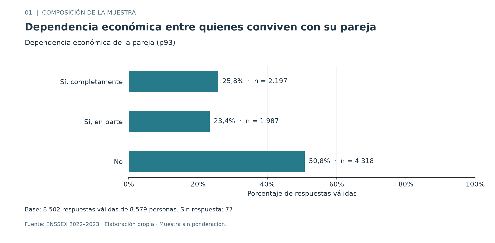
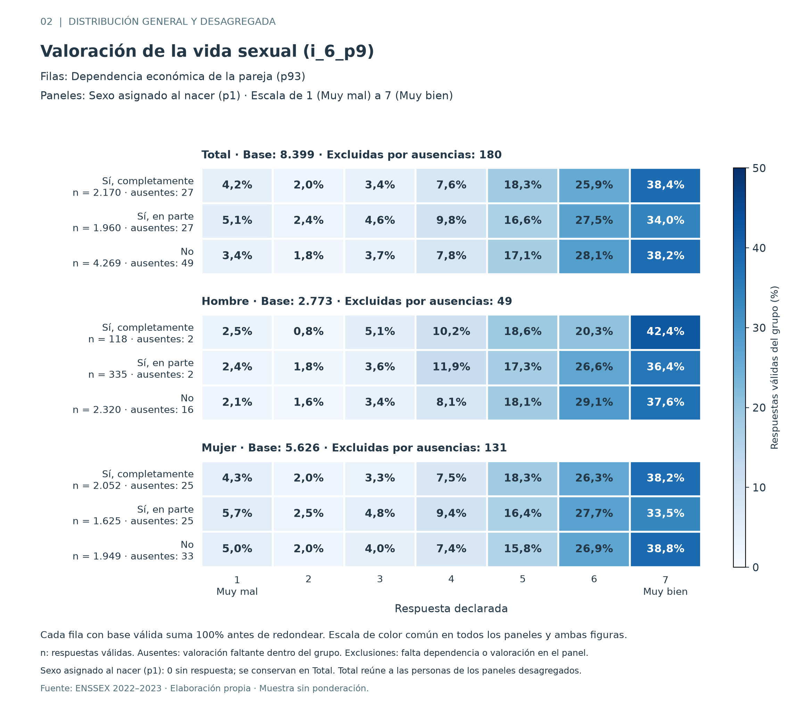
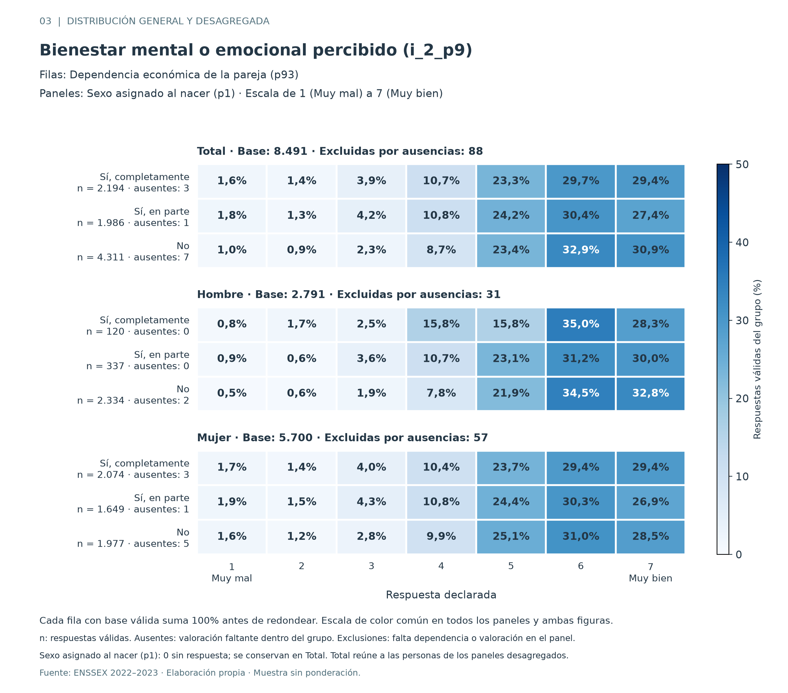

# Resultados descriptivos de F4

Buscamos responder cómo varían la valoración de la vida sexual (`i_6_p9`) y el bienestar mental o emocional percibido (`i_2_p9`) según la dependencia económica de la pareja (`p93`), entre personas encuestadas que conviven con ella. Describimos la muestra sin ponderación. No estimamos efectos causales ni significancia estadística.

Como profundización, desagregamos por sexo asignado al nacer (`p1`), variable complementaria seleccionada en las fases anteriores. Conservamos la pregunta principal y sus resultados generales. Esta variable distingue las categorías Hombre y Mujer de la fuente y se mantiene separada del género declarado (`p3`), que no se utiliza en esta desagregación.

## Base y denominadores

Partimos de 8.579 personas. La dependencia económica de la pareja (`p93`) tiene 8.502 respuestas válidas y 77 ausencias. Cada valoración utiliza únicamente personas con respuesta válida en esa dimensión y en dependencia económica. No descartamos globalmente a quien tenga una ausencia en la otra dimensión.

| Dependencia económica de la pareja (`p93`) | Personas del grupo | Vida sexual (`i_6_p9`): válidas / ausentes | Bienestar mental o emocional (`i_2_p9`): válidas / ausentes |
| --- | ---: | ---: | ---: |
| Sí, completamente | 2.197 | 2.170 / 27 | 2.194 / 3 |
| Sí, en parte | 1.987 | 1.960 / 27 | 1.986 / 1 |
| No | 4.318 | 4.269 / 49 | 4.311 / 7 |
| Total con dependencia registrada | 8.502 | 8.399 / 103 | 8.491 / 11 |

En valoración de la vida sexual (`i_6_p9`) hay 105 ausencias en la muestra completa; dos corresponden también a personas sin dependencia económica registrada (`p93`). Por ello, 8.579 − 77 − 105 + 2 = 8.399 personas integran esa comparación. En bienestar mental o emocional (`i_2_p9`) no se superponen las ausencias: 8.579 − 77 − 11 = 8.491.

Los porcentajes de las valoraciones se calculan dentro de cada grupo, sobre sus respuestas válidas. Los conteos permanecen enteros; redondeamos porcentajes solo para presentarlos. Una categoría sin observaciones representa 0% cuando existe base; un grupo sin respuestas válidas tiene porcentaje no calculable. El subconjunto con las tres respuestas válidas tiene 8.392 personas, pero no es la base de las figuras por dimensión.

### Composición por sexo asignado al nacer

La variable sexo asignado al nacer (`p1`) tiene 2.822 hombres y 5.757 mujeres, sin ausencias. Los grupos de dependencia económica de la pareja (`p93`) tienen composiciones diferentes:

| Sexo asignado al nacer (`p1`) | Dependencia completa | Dependencia parcial | Sin dependencia | Dependencia ausente |
| --- | ---: | ---: | ---: | ---: |
| Hombre | 120 | 337 | 2.336 | 29 |
| Mujer | 2.077 | 1.650 | 1.982 | 48 |

Los porcentajes desagregados se calculan dentro de cada combinación de sexo y dependencia, con respuesta válida en la valoración correspondiente. No se usa el total de hombres o mujeres como denominador de cada fila del mapa de calor.

| Sexo asignado al nacer (`p1`) | Dependencia económica de la pareja (`p93`) | Vida sexual (`i_6_p9`): válidas / ausentes | Bienestar mental o emocional (`i_2_p9`): válidas / ausentes |
| --- | --- | ---: | ---: |
| Hombre | Sí, completamente | 118 / 2 | 120 / 0 |
| Hombre | Sí, en parte | 335 / 2 | 337 / 0 |
| Hombre | No | 2.320 / 16 | 2.334 / 2 |
| Mujer | Sí, completamente | 2.052 / 25 | 2.074 / 3 |
| Mujer | Sí, en parte | 1.625 / 25 | 1.649 / 1 |
| Mujer | No | 1.949 / 33 | 1.977 / 5 |

La comparación de valoración de la vida sexual (`i_6_p9`) contiene 2.773 hombres y 5.626 mujeres, que suman 8.399. La de bienestar mental o emocional (`i_2_p9`) contiene 2.791 hombres y 5.700 mujeres, que suman 8.491. Los conteos de cada categoría también reconstruyen exactamente la distribución general. Si aparecieran ausencias en sexo asignado al nacer (`p1`), el código las conservaría en el total y las informaría por separado, sin asignarlas a hombre o mujer.

## Figura 1: composición según dependencia económica

Entre las 8.502 respuestas válidas de dependencia económica de la pareja (`p93`), 4.318 personas declaran no depender (50,79%), 2.197 depender completamente (25,84%) y 1.987 depender en parte (23,37%). El grupo sin dependencia reúne aproximadamente la mitad de las respuestas válidas.

Esta figura responde al objetivo de describir la distribución de dependencia. Como los grupos tienen tamaños diferentes, las siguientes figuras comparan porcentajes internos a cada grupo. Las 77 ausencias se informan por separado y no se interpretan como falta de dependencia.

## Figura 2: valoración de la vida sexual

La respuesta «7 Muy bien» es la más frecuente en los tres grupos de dependencia económica de la pareja (`p93`). En valoración de la vida sexual (`i_6_p9`) alcanza 38,43% con dependencia completa, 33,98% con dependencia parcial y 38,16% sin dependencia. Las respuestas 6 representan 25,94%, 27,50% y 28,13%, respectivamente.

La dependencia parcial presenta menor proporción de respuesta 7 que los otros grupos. Sin embargo, los porcentajes de respuesta 7 son muy similares entre dependencia completa y ausencia de dependencia. La distribución no respalda afirmar un aumento uniforme de esta valoración al disminuir la dependencia. La figura conserva las siete respuestas: no transforma un punto seleccionado de la escala en un indicador de toda la distribución.

La comparación usa 8.399 personas. Las ausencias de valoración dentro de los tres grupos representan 1,23%, 1,36% y 1,13%, respectivamente. Su magnitud se declara, pero no suponemos que esas ausencias sean aleatorias.

Al desagregar por sexo asignado al nacer (`p1`), la dependencia parcial conserva la menor proporción de respuesta «7 Muy bien» de valoración de la vida sexual (`i_6_p9`) en ambos sexos. En hombres, las proporciones son 42,37%, 36,42% y 37,63% para dependencia completa, parcial y ausencia de dependencia; en mujeres, 38,21%, 33,48% y 38,79%. El grupo de hombres con dependencia completa tiene solo 118 respuestas válidas de esta valoración, por lo que no interpretamos su porcentaje máximo de forma aislada del tamaño del grupo ni del resto de la distribución.

## Figura 3: bienestar mental o emocional percibido

En bienestar mental o emocional percibido (`i_2_p9`), el grupo sin dependencia económica de la pareja (`p93`) tiene mayor proporción de respuestas 6 (32,92%) y 7 (30,85%) que los grupos con dependencia completa (29,72% y 29,35%) o parcial (30,41% y 27,39%). Aun así, entre dependencia completa y parcial el orden cambia según se observe la respuesta 6 o la 7; evitamos describir un gradiente uniforme.

La comparación usa 8.491 personas. Hay 3, 1 y 7 ausencias de esta valoración dentro de los grupos completo, parcial y sin dependencia. Las figuras 2 y 3 utilizan las mismas categorías y una escala de color común a los seis paneles para facilitar su lectura, pero las bases de personas de ambas dimensiones no son idénticas.

La desagregación por sexo asignado al nacer (`p1`) matiza el resultado general. En hombres, la respuesta «7 Muy bien» de bienestar mental o emocional percibido (`i_2_p9`) representa 28,33%, 29,97% y 32,82% en dependencia completa, parcial y ausencia de dependencia. En mujeres, representa 29,41%, 26,86% y 28,53%: el orden entre dependencia completa y ausencia de dependencia es distinto del observado en hombres y en el total.

Este patrón de la respuesta 7 no resume toda la escala. Por ejemplo, en hombres la respuesta 6 representa 35,00%, 31,16% y 34,53%, sin el mismo aumento uniforme. Por eso mostramos las siete respuestas y no concluimos que toda la distribución mejore de manera uniforme. La composición por sexo y las diferencias internas ayudan a interpretar el total, pero este análisis descriptivo no demuestra que una variable explique o cause las diferencias de otra.

## Respuesta descriptiva y límites

En la muestra analizada observamos diferencias entre grupos de dependencia económica de la pareja (`p93`) en ambas dimensiones. En valoración de la vida sexual (`i_6_p9`), la respuesta máxima tiene frecuencias relativas semejantes en los grupos con dependencia completa y sin dependencia, y menor frecuencia en dependencia parcial. En bienestar mental o emocional percibido (`i_2_p9`), el grupo sin dependencia presenta las mayores proporciones de respuestas 6 y 7. Estos patrones no equivalen a una relación uniforme entre dependencia y ambas valoraciones.

La desagregación por sexo asignado al nacer (`p1`) muestra que el menor porcentaje de respuesta máxima con dependencia parcial en valoración de la vida sexual (`i_6_p9`) se observa tanto en hombres como en mujeres. En cambio, el patrón de respuesta máxima en bienestar mental o emocional percibido (`i_2_p9`) difiere entre ambos sexos. Por ello, el resultado agregado no representa de igual manera lo observado dentro de cada grupo.

Las distribuciones responden a los objetivos de caracterizar y comparar grupos. No comparamos puntuaciones individuales entre dimensiones ni construimos un índice combinado. La escala es ordinal; no imponemos distancias iguales entre sus valores ni cortes de bienestar «alto» o «bajo».

El análisis está desagregado por sexo asignado al nacer (`p1`), pero no está ponderado ni constituye un ajuste multivariable por edad, género, ingresos u otras características. Las diferencias pueden reflejar composición de los grupos y otros factores; no permiten atribuir efectos a la dependencia ni extrapolar a toda la población de Chile. El bienestar declarado es una percepción y no un diagnóstico clínico. Los tamaños de los grupos son desiguales, especialmente los 120 hombres con dependencia completa, y no calculamos incertidumbre ni pruebas de hipótesis. Una mejora posterior sería ampliar el estudio de composición y, con justificación metodológica, realizar un análisis ponderado o ajustado.

## Reproducción y respaldo

Las ocho tablas agregadas (cuatro generales y cuatro desagregadas) y el registro completo están en [resultados](../resultados/). El [módulo de análisis](../src/analisis_descriptivo.py) lee el CSV interpretable junto con su JSON mediante la función de verificación, calcula las tablas y exporta las figuras. El registro conserva huellas de las entradas, del código y de los productos, además de las versiones del entorno. No contiene microdatos individuales.

Las [pruebas del análisis](../tests/validar_analisis.py) comprueban denominadores con resultados manuales, ausencias superpuestas, sexo sin respuesta, conciliación entre estratos y total, grupos sin base, categorías con cero, orden de la escala, conservación de entradas, correspondencia entre figuras y tablas, repetición de la exportación y rechazo de archivos alterados o sobrescrituras. Las instrucciones están en [README de F4](../README.md).
